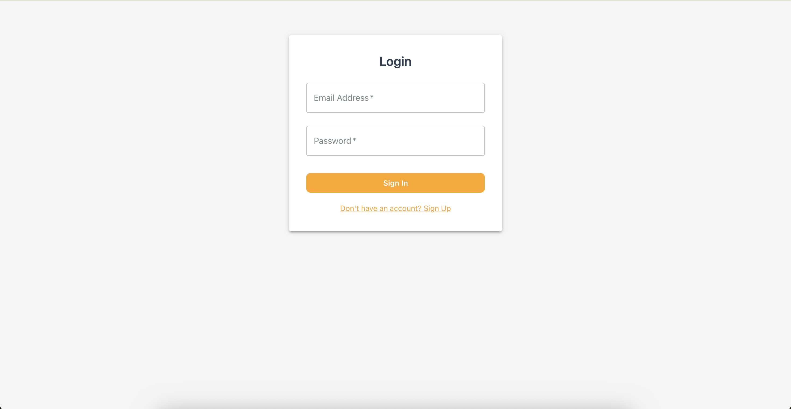
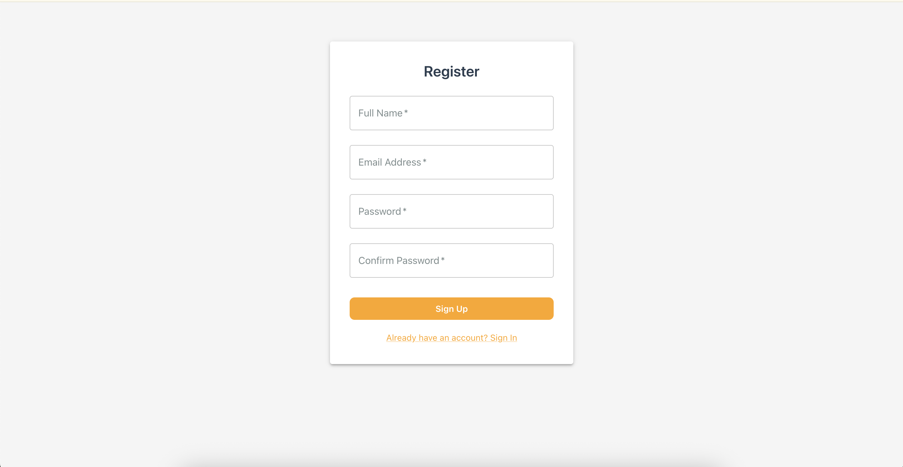
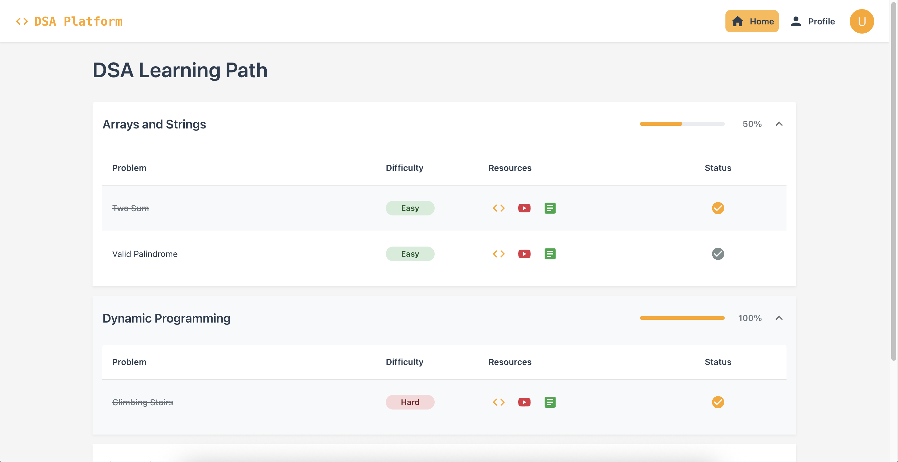
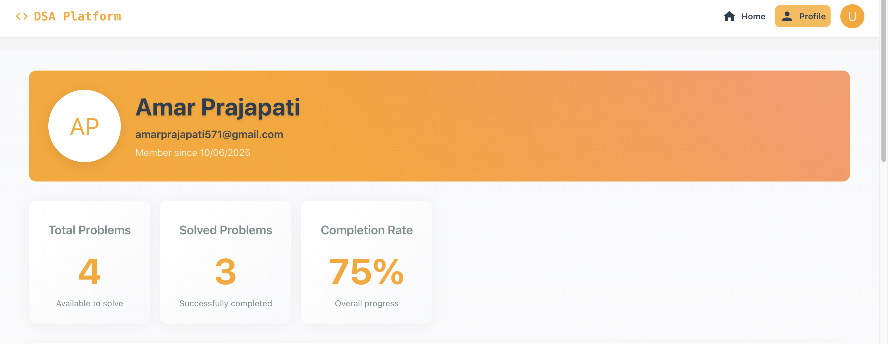
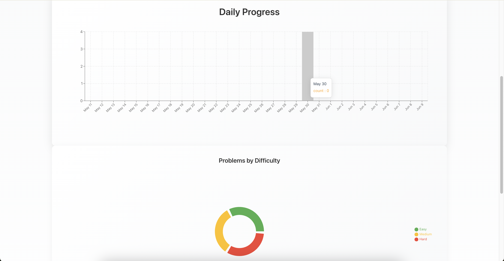
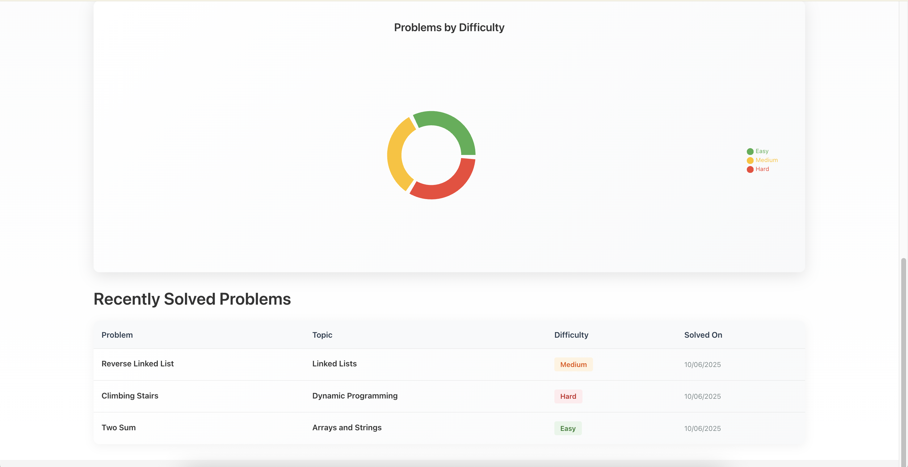

# Coding Platform Frontend

A modern, interactive coding platform built with React and Material-UI that provides a seamless experience for users to practice coding problems, track their progress, and improve their skills.

## 🚀 Features

- **User Authentication**: Secure login and registration system
- **Problem Solving Interface**: Clean and intuitive code editor with real-time feedback
- **Progress Tracking**: Visual analytics and statistics of your coding journey
- **Profile Dashboard**: Comprehensive overview of your achievements and progress
- **Problem Categories**: Organized problems by topics and difficulty levels
- **Responsive Design**: Works seamlessly on desktop and mobile devices

## 📸 Screenshots

### Login Page


### Register Page


### Home Page


### Profile Dashboard



*Comprehensive overview of user's coding progress and achievements*


## 🎥 Demo Video

[Watch Demo Video](https://www.loom.com/share/49d4f00501a3445e8d9a217670795b45?sid=6ceee872-baf0-4926-a3cc-2a0cd500790b)

## 🛠️ Tech Stack

- **Frontend**: React, Material-UI, Recharts
- **State Management**: React Context API
- **Styling**: Material-UI, Custom CSS
- **Charts**: Recharts
- **API Integration**: Axios

## 🚀 Getting Started

### Prerequisites

- Node.js (v14 or higher)
- npm or yarn
- Git

### Installation

1. Clone the repository:
```bash
git clone hhttps://github.com/amarprajapati571/codingplatform-frontend.git
cd codingplatform-frontend
```

2. Install dependencies:
```bash
npm install
# or
yarn install
```

3. Create a `.env` file in the root directory and add your environment variables:
```env
REACT_APP_API_URL=http://localhost:9000
```

4. Start the development server:
```bash
npm start
# or
yarn start
```

The application will be available at `http://localhost:3000`

## 📁 Project Structure

```
src/
├── components/     # Reusable UI components
├── pages/         # Page components
├── context/       # React context providers
├── services/      # API services
├── utils/         # Utility functions
├── assets/        # Static assets
└── styles/        # Global styles
```

## 🔧 Configuration

The application can be configured through environment variables:

- `REACT_APP_API_URL`: Backend API URL
- `REACT_APP_ENV`: Environment (development/production)


## 📝 License

This project is licensed under the MIT License - see the [LICENSE](LICENSE) file for details.

## 👥 Authors

- Your Name - Initial work - [YourGitHub](https://github.com/amarprajapati571)

## 🙏 Acknowledgments

- Material-UI for the beautiful component library
- Recharts for the amazing charting capabilities

